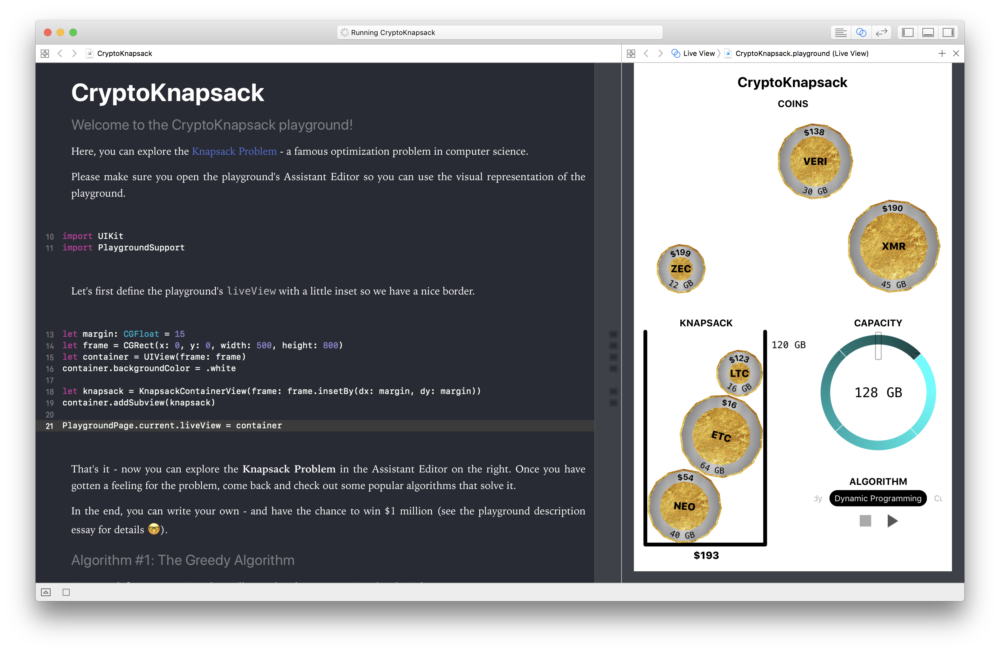

# Crypto Knapsack

This Xcode playground lets you explore the [Knapsack Problem](https://en.wikipedia.org/wiki/Knapsack_problem) - a
famous optimization problem in computer science.
It contains several optimization algorithms and also allows you
to write your own - and watch it solve the problem in the UI.

Formally stated, the task is the following: given n items

that each have a size 
and a profit ,
find a subset of the items such that:
1. the sum of profits  is maximized and
2. the sum of sizes  for some fixed boundary S

The Knapsack problem is NP-hard (which basically means that we don’t have an efficient
algorithm that solves it), so it is unlikely that someone will find a deterministic and
optimal polynomial-time algorithm.

**_But who says you can’t be the one? Give it a try!_**

(Side note: if you find such an algorithm, you would have proved that
 -
one of the seven [Millenium Prize Problems](https://en.wikipedia.org/wiki/Millennium_Prize_Problems)
awarded $1 million for solving it).

### Screenshot

### More Background
Let’s say you’d like to invest in cryptocurrency.
And let’s say you’d also like to mine some coins yourself.
In order for you to be able to do so, you need to download the respective blockchain.

This could be a lot of data you have to put on your machine - the blockchain for Ethereum for example is about 350 GB
large (as of March 2018). 

So to maximize your profits, not only do you have to monitor which currency increases in value,
but also decide which currency gives you the most profits compared to the storage needed.

This is an instance of the popular Knapsack optimization problem in 
computer science. Here, the items are the currencies, the sizes the 
blockchain sizes and the profits are the dollar value per coin. The 
boundary S is the storage you have available on your computer.

### Prerequisites

This project uses Swift 4 and is built for Xcode 9.

## License

This project is licensed under the MIT License.